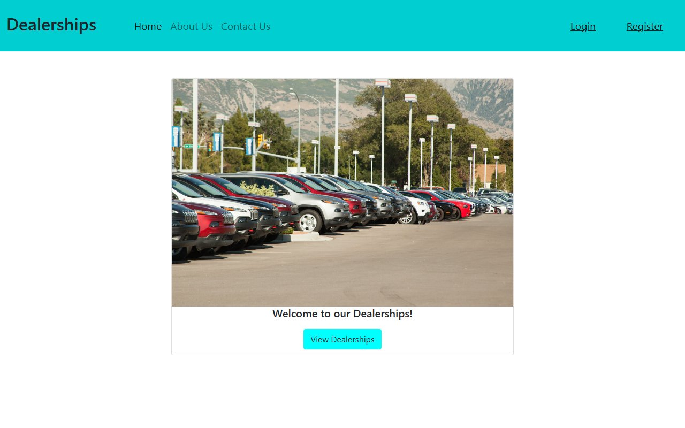
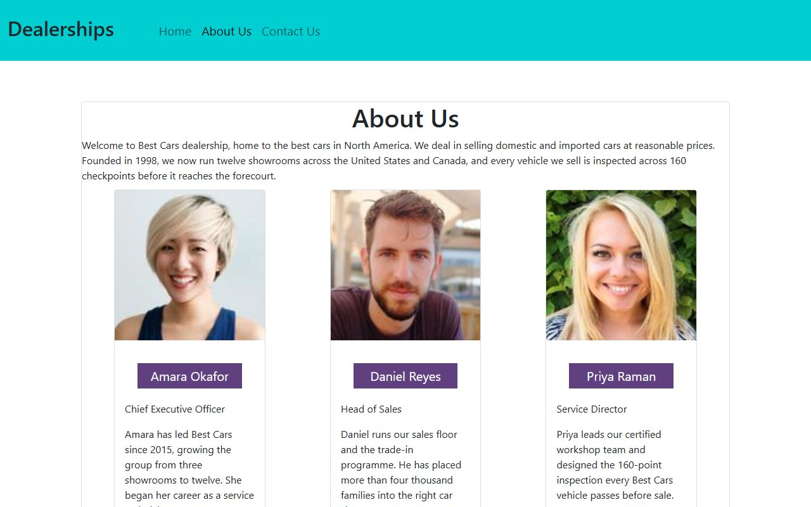

# Car Dealership Review Portal

Final capstone project for the **IBM Full Stack Software Developer** Professional Certificate ([verified](https://coursera.org/verify/professional-cert/ZYDXA0Y9YY1V)).

A full-stack web application for a national car dealership network. Visitors can browse dealerships, filter them by state, and read customer reviews, each with an automatically generated **sentiment label**. Registered users can sign in and post their own reviews, choosing the car make and model they bought.

It's built as a set of services: a Django web app, a React front end, a Node/Express + MongoDB API, and a Flask sentiment microservice. All are containerised, deployed to Kubernetes, and linted in CI.



## Architecture

```
                    ┌─────────────────────────────┐
  Browser  ───────▶ │ Django  (djangoproj)        │  static pages: Home, About, Contact
  (React SPA)       │  · serves the React build   │
                    │  · auth: login / register   │
                    │  · CarMake / CarModel (SQLite)
                    │  · proxy views (restapis.py)│
                    └──────┬──────────────┬───────┘
                           │              │
            GET/POST       ▼              ▼   GET /analyze/<text>
          ┌───────────────────────┐   ┌──────────────────────────┐
          │ Node.js + Express     │   │ Flask + NLTK VADER       │
          │ dealers & reviews API │   │ sentiment microservice   │
          │ MongoDB (Mongoose)    │   │ (IBM Code Engine)        │
          └───────────────────────┘   └──────────────────────────┘
```

| Layer | Technology |
| --- | --- |
| Front end | React, React Router |
| Web application | Django |
| Dealers and reviews | Node.js, Express, MongoDB, Mongoose |
| Car makes and models | Django ORM on SQLite |
| Sentiment analysis | Python microservice using NLTK on IBM Code Engine |
| Packaging | Docker, Kubernetes |
| CI | GitHub Actions running flake8 and JSHint |

## Features

- Dealership list with **filter by state**, and a dealer detail page with all its reviews
- Every review shows a **positive / neutral / negative** icon from the sentiment service
- **Register / log in / log out** (Django auth, called from React)
- **Post a review** with purchase date and car make/model/year (logged-in users)
- Django admin for car makes and models
- Static **About Us** and **Contact Us** pages

## APIs

**Node / Express** (`server/database/app.js`, port 3030)

| Route | Returns |
|---|---|
| `GET /fetchDealers` · `GET /fetchDealers/:state` | all dealers, or dealers in one state |
| `GET /fetchDealer/:id` | one dealer |
| `GET /fetchReviews` · `GET /fetchReviews/dealer/:id` | reviews, or reviews for one dealer |
| `POST /insert_review` | add a review |

**Django** (`server/djangoapp/urls.py`, under `/djangoapp/`)

`register` · `login` · `logout` · `get_cars` · `get_dealers[/<state>]` · `dealer/<id>` · `reviews/dealer/<id>` (with sentiment) · `add_review`

## Screenshots

| Home | About Us |
|---|---|
|  |  |

## Run locally

```bash
git clone https://github.com/abdullah2036/xrwvm-fullstack_developer_capstone.git
cd xrwvm-fullstack_developer_capstone/server

# 1. Dealers & reviews API + MongoDB
cd database
docker build . -t nodeapp
docker-compose up -d                     # API on :3030, Mongo on :27017
cd ..

# 2. React front end (built into Django's static files)
cd frontend && npm install && npm run build && cd ..

# 3. Django
pip install -r requirements.txt
python manage.py makemigrations && python manage.py migrate
python manage.py runserver               # http://localhost:8000
```

Set `backend_url` and `sentiment_analyzer_url` in `server/djangoapp/.env` to point Django at the API and the sentiment service. The sentiment service lives in `server/djangoapp/microservices/` and has its own `Dockerfile`.

**Kubernetes:** `server/Dockerfile` + `entrypoint.sh` build the Django image (migrations and `collectstatic` run on start), and `server/deployment.yaml` deploys it on port 8000.

## Project structure

```
server/
├── djangoproj/            Django project: settings, root URLs (Home/About/Contact + React routes)
├── djangoapp/
│   ├── models.py          CarMake, CarModel
│   ├── views.py           auth, cars, dealers, reviews, add_review
│   ├── restapis.py        calls to the Node API and the sentiment service
│   ├── populate.py        seed data for car makes/models
│   └── microservices/     Flask + NLTK sentiment analyzer (Dockerfile)
├── database/              Node/Express + Mongoose API, seed JSON, Dockerfile, docker-compose
├── frontend/              React app: Dealers, Dealer, PostReview, Login, Register, Header
├── Dockerfile · entrypoint.sh · deployment.yaml
└── requirements.txt
.github/workflows/main.yml  CI: flake8 (Python) + JSHint (JavaScript)
```

---

Built by **Abdullah Bokhary** · [Portfolio](https://abdullah.pageui.workers.dev/) · [LinkedIn](https://www.linkedin.com/in/abdullah-bokhary-840315326/) · [GitHub](https://github.com/abdullah2036)
